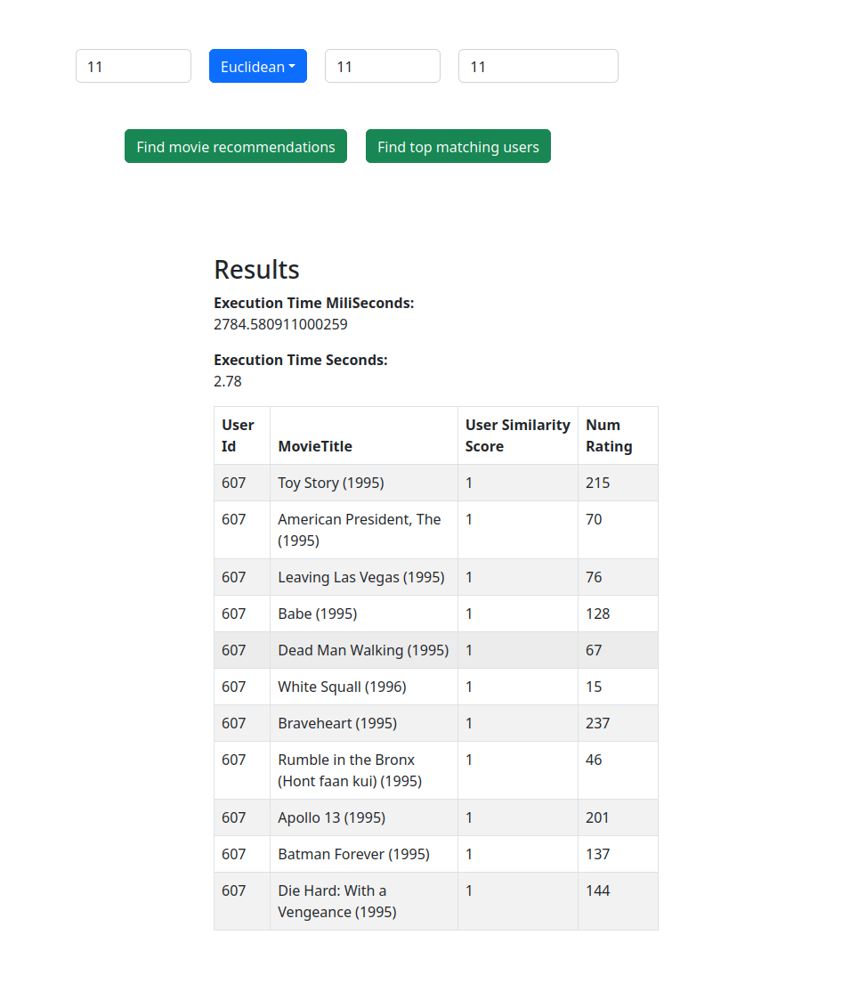

# Elasticsearch Big Data Movie Recommendation System.

## About
React frontend with Elasticsearch, queried by express as a REST API.

Installation instructions:
elasticsearch with docker:
https://www.elastic.co/guide/en/elasticsearch/reference/current/docker.html
sudo docker start elasticsearch

Make sure to change the .env files with your credentials.

To run the parser first install dependencies:
pip install elasticsearch
pip install python-dotenv

cd parser
python parser.py

cd api \
npm i \
npm start

cd ui \
npm start

